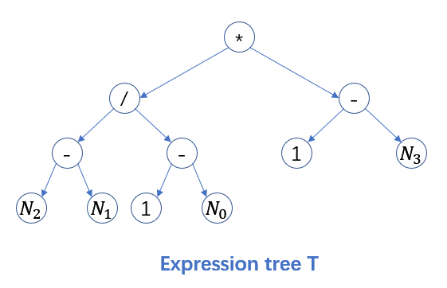
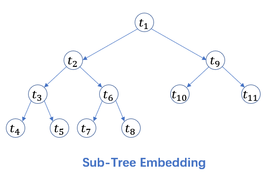
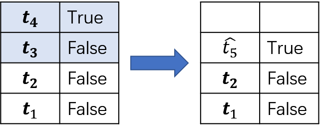
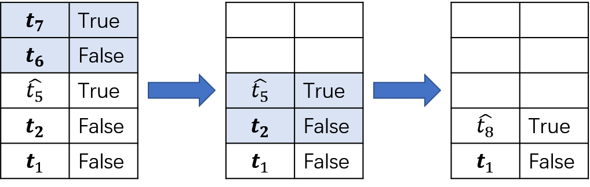
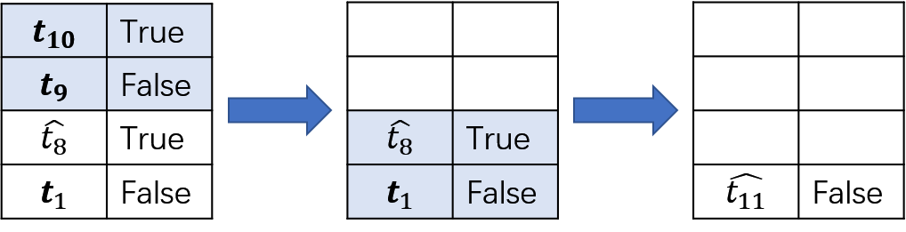

## Graph2Tree中节点的生成过程

#### 前序表达式

```bash
[0, 3, 1, 9,  8,  1, 5, 7,  1, 5, 10]
[*, /, -, N2, N1, -, 1, N0, -, 1, N3]
```





#### sub-tree embedding的生成过程

##### (1) $t_{1}(operator)$ 


$left \_\ childs:$ 


##### (2) $t_{2}(operator)$


$left _ childs:$ 


##### (3) $t_{3}(operator)$


$left\_childs:$ 


##### (4) $t_{4}(number)$


$left\_childs:$ 


##### (5) $t_{5}(number)$



$left\_childs:$ 


##### (6) $t_{6}(operator)$


$left\_childs:$ 


##### (7) $t_{7}(number)$


$left\_childs:$ 


##### (8) $t_{8}(number)$



$left\_childs:$ 


##### (9) $t_{9}(operator)$


$left\_childs:$ 


##### (10) $t_{10}(number)$


$left\_childs:$ 


##### (11) $t_{11}(number)$



$left\_childs:$ 


